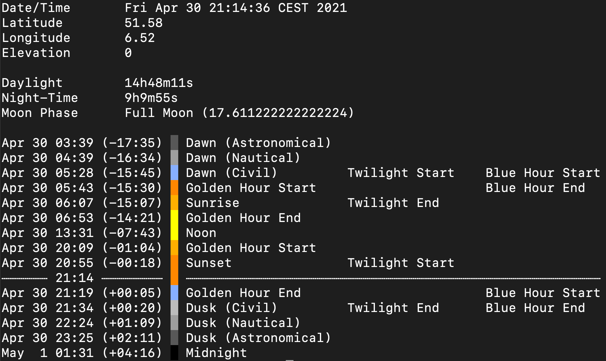

# Astral


[](https://goreportcard.com/report/github.com/sj14/astral)
[](https://godoc.org/github.com/sj14/astral)

Calculations for the position of the sun and moon.

This is a Go port of the Python [astral](https://github.com/sffjunkie/astral) package.

The `astral` package provides the means to calculate the following times of the sun:

* dawn
* sunrise
* noon
* midnight
* sunset
* dusk
* daylight
* night
* twilight
* blue hour
* golden hour
* ~~rahukaalam~~ TODO

plus solar azimuth and elevation at a specific latitude/longitude.
It can also calculate the moon phase for a specific date.

## CLI

Besides the package for usage in you own programs, we also provide a tool for showing the data.



### Installation

```text
go get github.com/sj14/astral/cmd/astral
```

### Usage

```text
Usage of astral:
  -elev float
        elevation of the observer
  -lat float
        latitude of the observer
  -long float
        longitude of the observer
  -time string
        day/time used for the calculation (defaults to current time)
```

### Example

```text
$ astral -lat 51.58 -long 6.52
Date/Time	Fri Apr 30 21:12:11 CEST 2021
Latitude	51.58
Longitude	6.52
Elevation	0

Daylight	14h48m11s
Night-Time	9h9m55s
Moon Phase	Full Moon (17.611222222222224)

Apr 30 03:39 (-17:32)   Dawn (Astronomical)
Apr 30 04:39 (-16:32)   Dawn (Nautical)
Apr 30 05:28 (-15:43)   Dawn (Civil)         Twilight Start    Blue Hour Start
Apr 30 05:43 (-15:28)   Golden Hour Start                      Blue Hour End
Apr 30 06:07 (-15:04)   Sunrise              Twilight End
Apr 30 06:53 (-14:18)   Golden Hour End
Apr 30 13:31 (-07:41)   Noon
Apr 30 20:09 (-01:02)   Golden Hour Start
Apr 30 20:55 (-00:16)   Sunset               Twilight Start
┈┈┈┈┈┈ 21:12 ┈┈┈┈┈┈┈┈   ┈┈┈┈┈┈┈┈┈┈┈┈┈┈┈┈┈┈┈┈┈┈┈┈┈┈┈┈┈┈┈┈┈┈┈┈┈┈┈┈┈┈┈┈┈┈┈┈┈┈┈┈┈┈
Apr 30 21:19 (+00:07)   Golden Hour End                        Blue Hour Start
Apr 30 21:34 (+00:22)   Dusk (Civil)         Twilight End      Blue Hour End
Apr 30 22:24 (+01:12)   Dusk (Nautical)
Apr 30 23:25 (+02:13)   Dusk (Astronomical)
May  1 01:31 (+04:18)   Midnight
```
